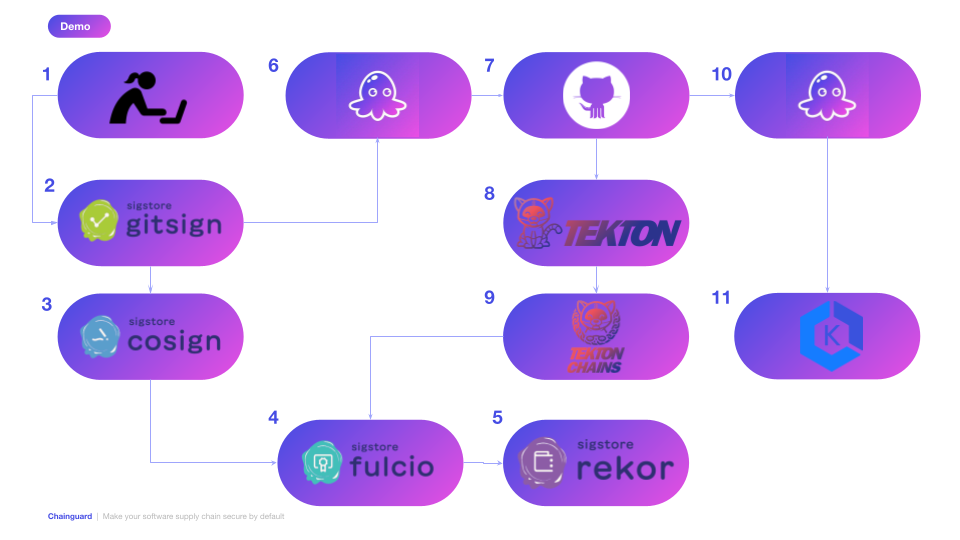
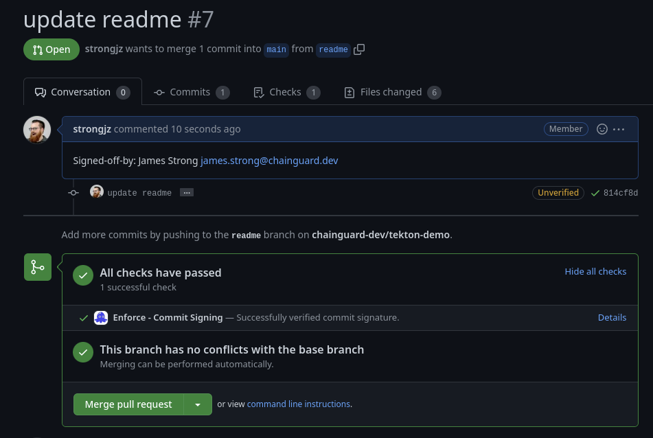
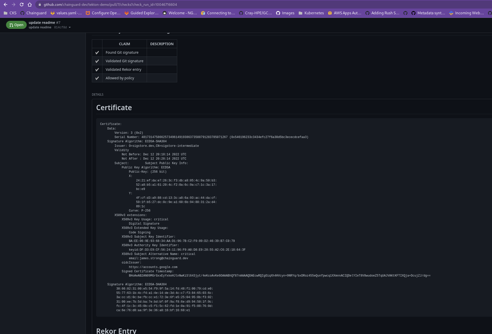

# tekton-demo
Tekton, Enforce for Git and Kubernetes Demo  



## Prerequisites

1. Build Kubernetes Cluster for tekton
2. Demo Kubernetes Cluster for testing Enforce for Kubernetes
3. OCI compliant Registry (GitHub Container Registry)

_Note_: You can use the same cluster for build and deploy if you'd like.

1. Deploy GKE Cluster
2. Deploy EKS Cluster
3. Deploy Tekton on GKE Cluster
4. Deploy Enforce on EKS Cluster

### GKE/EKS Cluster

Terraform will deploy both the GKE and EKS. Tekton is two steps, deploying the cluster then tekton 

1. GKE Deployment is in terraform/tekton/1-infrastructure 
2. Tekton deploy is in terraform/tekton/2-post-installation
3. EKS deployment is in terraform/eks 

The GKE cluster is deployed behind a bastion, the information to access it is in the terraform output. The GKE
commands need the bastion set for the HTTPS_PROXY. 

Now we can install the Chainguard enforce agent on the EKS Cluster, more information on how to do that is on our
[Chainguard Academy](https://edu.chainguard.dev/chainguard/chainguard-enforce/chainguard-enforce-kubernetes/how-to-connect-kubernetes-clusters/)

You are now ready for the Demos.

## Demos 

### Tools needed

1. [chainctl](https://edu.chainguard.dev/chainguard/chainguard-enforce/how-to-install-chainctl/)
2. [terraform](https://developer.hashicorp.com/terraform/downloads)
2. [gcloud cli](https://cloud.google.com/sdk/docs/install)
3. [aws cli](https://docs.aws.amazon.com/cli/latest/userguide/getting-started-install.html)
4. [cosign](https://docs.sigstore.dev/cosign/installation/)
5. [gitsign](https://docs.sigstore.dev/gitsign/installation/)
6. [tkn - tekton cli](https://github.com/tektoncd/cli#installing-tkn)
7. [kubectl](https://kubernetes.io/docs/tasks/tools/#kubectl)
8. [git](https://git-scm.com/book/en/v2/Getting-Started-Installing-Git)

Others that our helpful not necessary 

[jq](https://stedolan.github.io/jq/download/), [yq](https://github.com/mikefarah/yq), [rekor-cli ](https://docs.sigstore.dev/rekor/cli/)

### Demo #1 Gitsign 

_Note_: This is step 1,2,3, 4 and 5 in the image 

```bash
git checkout -b readme
Switched to a new branch 'readme'
[strongjz@hulk-linux tekton-demo]$ git status
On branch readme
Changes to be committed:
  (use "git restore --staged <file>..." to unstage)
        modified:   README.md
        modified:   config/gcp/pipeline.yaml
        modified:   config/go/ko-build-image.yaml
        deleted:    kind.yaml
        deleted:    setup.sh
        new file:   static/demo.png

[strongjz@hulk-linux tekton-demo]$ git commit -sm"update readme"
error getting cached creds: "/home/strongjz/Documents/code/go/src/github.com/chainguard-dev/tekton-demo" not found
Your browser will now be opened to:
https://oauth2.sigstore.dev/auth/auth?access_type=online&client_id=sigstore&code_challenge=p_j8JRojZS01K7zqbk9X19OBhKLRMqAO8t-XOCty2MA&code_challenge_method=S256&nonce=2IpQx7Xp7tfe3J1DNMMF9KJBRl1&redirect_uri=http%3A%2F%2Flocalhost%3A38113%2Fauth%2Fcallback&response_type=code&scope=openid+email&state=2IpQxC57BSU3I757W5ciGcu3Jy0
tlog entry created with index: 8954011
[readme 814cf8d] update readme
 6 files changed, 172 insertions(+), 389 deletions(-)
 delete mode 100644 kind.yaml
 delete mode 100755 setup.sh
 create mode 100644 static/demo.png
[strongjz@hulk-linux tekton-demo]$ 
[strongjz@hulk-linux tekton-demo]$ git push origin readme
Enumerating objects: 17, done.
Counting objects: 100% (17/17), done.
Delta compression using up to 32 threads
Compressing objects: 100% (9/9), done.
Writing objects: 100% (10/10), 126.96 KiB | 11.54 MiB/s, done.
Total 10 (delta 4), reused 0 (delta 0), pack-reused 0
remote: Resolving deltas: 100% (4/4), completed with 4 local objects.
remote: 
remote: Create a pull request for 'readme' on GitHub by visiting:
remote:      https://github.com/chainguard-dev/tekton-demo/pull/new/readme
remote: 
To github.com:chainguard-dev/tekton-demo.git
 * [new branch]      readme -> readme
```


```bash
gitsign show
```

A Git sign attestation 
```json
{
  "_type": "https://in-toto.io/Statement/v0.1",
  "predicateType": "gitsign.sigstore.dev/predicate/git/v0.1",
  "subject": [
    {
      "name": "git@github.com:chainguard-dev/tekton-demo.git",
      "digest": {
        "sha1": "814cf8d02a07a46694fc39d8811dde061d485b13"
      }
    }
  ],
  "predicate": {
    "source": {
      "tree": "209e2755dd4ca173619c82edd5cf098ae6b047b7",
      "parents": [
        "da09cbd0331c2074a5ff4b337ae88bf8e6893d14"
      ],
      "author": {
        "name": "James Strong",
        "email": "james.strong@chainguard.dev",
        "date": "2022-12-12T15:18:08-05:00"
      },
      "committer": {
        "name": "James Strong",
        "email": "james.strong@chainguard.dev",
        "date": "2022-12-12T15:18:08-05:00"
      },
      "message": "update readme\n\nSigned-off-by: James Strong \u003cjames.strong@chainguard.dev\u003e\n"
    },
    "signature": "-----BEGIN SIGNED MESSAGE-----\nMIIECwYJKoZIhvcNAQcCoIID/DCCA/gCAQExDTALBglghkgBZQMEAgEwCwYJKoZI\nhvcNAQcBoIICrDCCAqgwggItoAMCAQICFFRhliM8NDTvwn9qMNW8Ps7NzvqjMAoG\nCCqGSM49BAMDMDcxFTATBgNVBAoTDHNpZ3N0b3JlLmRldjEeMBwGA1UEAxMVc2ln\nc3RvcmUtaW50ZXJtZWRpYXRlMB4XDTIyMTIxMjIwMTgxNFoXDTIyMTIxMjIwMjgx\nNFowADBZMBMGByqGSM49AgEGCCqGSM49AwEHA0IABCQh79rnJjzz26gFTJpQs1Ko\ntaFhIEzyCmyaxxw6F7zpT8/TqYjNEzyoapOsRNrPWR+1J9yMnqFga5SIMSrUiRyj\nggFMMIIBSDAOBgNVHQ8BAf8EBAMCB4AwEwYDVR0lBAwwCgYIKwYBBQUHAwMwHQYD\nVR0OBBYEFLruBp6TaDSq0ZZ7wvmJ0kY5t8B5MB8GA1UdIwQYMBaAFN/T6c9WJBGW\n+ajY6ShVosYuGGQ/MCkGA1UdEQEB/wQfMB2BG2phbWVzLnN0cm9uZ0BjaGFpbmd1\nYXJkLmRldjApBgorBgEEAYO/MAEBBBtodHRwczovL2FjY291bnRzLmdvb2dsZS5j\nb20wgYoGCisGAQQB1nkCBAIEfAR6AHgAdgDdPTBqxscRMmMZHhyZZzcCokpeuN48\nrf+HinKALynujgAAAYUH/O5wAAAEAwBHMEUCIDoql4eB1XMp/vTUWKv28Q0aM+Oe\nXkLp36cHKtV15p5wAiEA3pWCHk/FfMLnaHmeU6lACVQCrShUyF0I2vg3Lo2Sf3Yw\nCgYIKoZIzj0EAwMDaQAwZgIxAOVU+Z9aFP1I8QB5zeBVd2MbTPShThTePUzH84Rl\nA2w6zNEMvvvM4XI+b+UlBJWL8wIxAO57Xbp+vb8Pmvhu2ZRQH5z8Txw8RQvF8Vxi\n/R4KkfWIdg3KbnbYqp8+NqgWvxZo4TGCASUwggEhAgEBME8wNzEVMBMGA1UEChMM\nc2lnc3RvcmUuZGV2MR4wHAYDVQQDExVzaWdzdG9yZS1pbnRlcm1lZGlhdGUCFFRh\nliM8NDTvwn9qMNW8Ps7NzvqjMAsGCWCGSAFlAwQCAaBpMBgGCSqGSIb3DQEJAzEL\nBgkqhkiG9w0BBwEwHAYJKoZIhvcNAQkFMQ8XDTIyMTIxMjIwMTgxN1owLwYJKoZI\nhvcNAQkEMSIEIOtoDT1tODgjWiAHP91ANr98NDMkEO59RZbD8yRKx+M3MAoGCCqG\nSM49BAMCBEcwRQIhAMEHnNxiW54gbVEW7SnL52H7dCCBtDTMISx/uM5VOxe6AiBg\nOVljutveX/cLT+/EQzVUs9dpb83hlUx9J7funrKLpg==\n-----END SIGNED MESSAGE-----\n",
    "signer_info": [
      {
        "attributes": "MWkwGAYJKoZIhvcNAQkDMQsGCSqGSIb3DQEHATAcBgkqhkiG9w0BCQUxDxcNMjIxMjEyMjAxODE3WjAvBgkqhkiG9w0BCQQxIgQg62gNPW04OCNaIAc/3UA2v3w0MyQQ7n1FlsPzJErH4zc=",
        "certificate": "-----BEGIN CERTIFICATE-----\nMIICqDCCAi2gAwIBAgIUVGGWIzw0NO/Cf2ow1bw+zs3O+qMwCgYIKoZIzj0EAwMw\nNzEVMBMGA1UEChMMc2lnc3RvcmUuZGV2MR4wHAYDVQQDExVzaWdzdG9yZS1pbnRl\ncm1lZGlhdGUwHhcNMjIxMjEyMjAxODE0WhcNMjIxMjEyMjAyODE0WjAAMFkwEwYH\nKoZIzj0CAQYIKoZIzj0DAQcDQgAEJCHv2ucmPPPbqAVMmlCzUqi1oWEgTPIKbJrH\nHDoXvOlPz9OpiM0TPKhqk6xE2s9ZH7Un3IyeoWBrlIgxKtSJHKOCAUwwggFIMA4G\nA1UdDwEB/wQEAwIHgDATBgNVHSUEDDAKBggrBgEFBQcDAzAdBgNVHQ4EFgQUuu4G\nnpNoNKrRlnvC+YnSRjm3wHkwHwYDVR0jBBgwFoAU39Ppz1YkEZb5qNjpKFWixi4Y\nZD8wKQYDVR0RAQH/BB8wHYEbamFtZXMuc3Ryb25nQGNoYWluZ3VhcmQuZGV2MCkG\nCisGAQQBg78wAQEEG2h0dHBzOi8vYWNjb3VudHMuZ29vZ2xlLmNvbTCBigYKKwYB\nBAHWeQIEAgR8BHoAeAB2AN09MGrGxxEyYxkeHJlnNwKiSl643jyt/4eKcoAvKe6O\nAAABhQf87nAAAAQDAEcwRQIgOiqXh4HVcyn+9NRYq/bxDRoz455eQunfpwcq1XXm\nnnACIQDelYIeT8V8wudoeZ5TqUAJVAKtKFTIXQja+DcujZJ/djAKBggqhkjOPQQD\nAwNpADBmAjEA5VT5n1oU/UjxAHnN4FV3YxtM9KFOFN49TMfzhGUDbDrM0Qy++8zh\ncj5v5SUElYvzAjEA7ntdun69vw+a+G7ZlFAfnPxPHDxFC8XxXGL9HgqR9Yh2Dcpu\ndtiqnz42qBa/Fmjh\n-----END CERTIFICATE-----\n"
      }
    ]
  }
}
```


### Demo #2 Enforce for Git 

[How to install Chainguard Enforce for Git](https://edu.chainguard.dev/chainguard/chainguard-enforce/chainguard-enforce-github/install-enforce-github/)

You can see in the PR https://github.com/chainguard-dev/tekton-demo/pull/7 that my commits were verified by Enforce for Git 





https://github.com/chainguard-dev/tekton-demo/pull/7/checks?check_run_id=10046716604




```bash
export IMAGE_ID=ghcr.io/chainguard-dev/tekton-demo:da09cbd@sha256:aaa82ba50684376426cdf84ebfeea34ea4e8fdb1191574b800559ab027f9e24d
[strongjz@hulk-linux tekton-demo]$ cosign attest --file <(gitsign show) $IMAGE_ID
Error: unknown flag: --file
main.go:62: error during command execution: unknown flag: --file
[strongjz@hulk-linux tekton-demo]$ cosign attest --predicate <(gitsign show) $IMAGE_ID
Generating ephemeral keys...
Retrieving signed certificate...

        Note that there may be personally identifiable information associated with this signed artifact.
        This may include the email address associated with the account with which you authenticate.
        This information will be used for signing this artifact and will be stored in public transparency logs and cannot be removed later.
        By typing 'y', you attest that you grant (or have permission to grant) and agree to have this information stored permanently in transparency logs.

Are you sure you want to continue? (y/[N]): y
Your browser will now be opened to:
https://oauth2.sigstore.dev/auth/auth?access_type=online&client_id=sigstore&code_challenge=CtXEmIqW92Wvyq5dCc1gqmRKJpw3WsGf__h0balZVrk&code_challenge_method=S256&nonce=2IpS54S8MOKXKbH3GYvH5BgqDka&redirect_uri=http%3A%2F%2Flocalhost%3A40421%2Fauth%2Fcallback&response_type=code&scope=openid+email&state=2IpS53Pznww1pusCFoIsxcmfmek
Successfully verified SCT...
Using payload from: /dev/fd/63
using ephemeral certificate:
-----BEGIN CERTIFICATE-----
MIICpzCCAiygAwIBAgIUEq0/s3JFzfALAY00Qx5UjD4XXBswCgYIKoZIzj0EAwMw
NzEVMBMGA1UEChMMc2lnc3RvcmUuZGV2MR4wHAYDVQQDExVzaWdzdG9yZS1pbnRl
cm1lZGlhdGUwHhcNMjIxMjEyMjAyNzI5WhcNMjIxMjEyMjAzNzI5WjAAMFkwEwYH
KoZIzj0CAQYIKoZIzj0DAQcDQgAEjmMpLaLJ25PETcJqORoVNdeOdN4HHTAMzJmn
fqF2Xt/FpF16abk5J1a+6Gx8WbWYa8GTf6MfyJURl0crFcJ4gKOCAUswggFHMA4G
A1UdDwEB/wQEAwIHgDATBgNVHSUEDDAKBggrBgEFBQcDAzAdBgNVHQ4EFgQUPEMC
RviIyZhBPg0knc9U9PaewlYwHwYDVR0jBBgwFoAU39Ppz1YkEZb5qNjpKFWixi4Y
ZD8wKQYDVR0RAQH/BB8wHYEbamFtZXMuc3Ryb25nQGNoYWluZ3VhcmQuZGV2MCkG
CisGAQQBg78wAQEEG2h0dHBzOi8vYWNjb3VudHMuZ29vZ2xlLmNvbTCBiQYKKwYB
BAHWeQIEAgR7BHkAdwB1AN09MGrGxxEyYxkeHJlnNwKiSl643jyt/4eKcoAvKe6O
AAABhQgFZiQAAAQDAEYwRAIgUY6E9nLyG/Fa1/wGacNBuDpMMGmx+Efcra/Hm60C
ObYCID2lGhTtS8OBJqstzer7uw0oWjujrV4p/YG90KswIsqqMAoGCCqGSM49BAMD
A2kAMGYCMQCvWce1jQfsVY4nomqgg23L8+5LyN4iRax6J3xZAqfoN3cdFy/QiLyc
s5BZ8N62OOACMQC6YtdU8A6jDjqF6o9tesyONHRxrmn9XqfGF8aj647FxuLBS7w+
H9fmTKrind2qG6s=
-----END CERTIFICATE-----

tlog entry created with index: 8954485
```

Then you can Verify it 

```bash
cosign verify-attestation $IMAGE_ID | jq -r .payload | base64 -d | jq

Verification for ghcr.io/chainguard-dev/tekton-demo:da09cbd@sha256:aaa82ba50684376426cdf84ebfeea34ea4e8fdb1191574b800559ab027f9e24d --
The following checks were performed on each of these signatures:
  - The cosign claims were validated
  - Existence of the claims in the transparency log was verified offline
  - Any certificates were verified against the Fulcio roots.
Certificate subject:  james.strong@chainguard.dev
Certificate issuer URL:  https://accounts.google.com
{
  "_type": "https://in-toto.io/Statement/v0.1",
  "predicateType": "cosign.sigstore.dev/attestation/v1",
  "subject": [
    {
      "name": "ghcr.io/chainguard-dev/tekton-demo",
      "digest": {
        "sha256": "aaa82ba50684376426cdf84ebfeea34ea4e8fdb1191574b800559ab027f9e24d"
      }
    }
  ],
  "predicate": {
    "Data": "{\n  \"_type\": \"https://in-toto.io/Statement/v0.1\",\n  \"predicateType\": \"gitsign.sigstore.dev/predicate/git/v0.1\",\n  \"subject\": [\n    {\n      \"name\": \"git@github.com:chainguard-dev/tekton-demo.git\",\n      \"digest\": {\n        \"sha1\": \"814cf8d02a07a46694fc39d8811dde061d485b13\"\n      }\n    }\n  ],\n  \"predicate\": {\n    \"source\": {\n      \"tree\": \"209e2755dd4ca173619c82edd5cf098ae6b047b7\",\n      \"parents\": [\n        \"da09cbd0331c2074a5ff4b337ae88bf8e6893d14\"\n      ],\n      \"author\": {\n        \"name\": \"James Strong\",\n        \"email\": \"james.strong@chainguard.dev\",\n        \"date\": \"2022-12-12T15:18:08-05:00\"\n      },\n      \"committer\": {\n        \"name\": \"James Strong\",\n        \"email\": \"james.strong@chainguard.dev\",\n        \"date\": \"2022-12-12T15:18:08-05:00\"\n      },\n      \"message\": \"update readme\\n\\nSigned-off-by: James Strong \\u003cjames.strong@chainguard.dev\\u003e\\n\"\n    },\n    \"signature\": \"-----BEGIN SIGNED MESSAGE-----\\nMIIECwYJKoZIhvcNAQcCoIID/DCCA/gCAQExDTALBglghkgBZQMEAgEwCwYJKoZI\\nhvcNAQcBoIICrDCCAqgwggItoAMCAQICFFRhliM8NDTvwn9qMNW8Ps7NzvqjMAoG\\nCCqGSM49BAMDMDcxFTATBgNVBAoTDHNpZ3N0b3JlLmRldjEeMBwGA1UEAxMVc2ln\\nc3RvcmUtaW50ZXJtZWRpYXRlMB4XDTIyMTIxMjIwMTgxNFoXDTIyMTIxMjIwMjgx\\nNFowADBZMBMGByqGSM49AgEGCCqGSM49AwEHA0IABCQh79rnJjzz26gFTJpQs1Ko\\ntaFhIEzyCmyaxxw6F7zpT8/TqYjNEzyoapOsRNrPWR+1J9yMnqFga5SIMSrUiRyj\\nggFMMIIBSDAOBgNVHQ8BAf8EBAMCB4AwEwYDVR0lBAwwCgYIKwYBBQUHAwMwHQYD\\nVR0OBBYEFLruBp6TaDSq0ZZ7wvmJ0kY5t8B5MB8GA1UdIwQYMBaAFN/T6c9WJBGW\\n+ajY6ShVosYuGGQ/MCkGA1UdEQEB/wQfMB2BG2phbWVzLnN0cm9uZ0BjaGFpbmd1\\nYXJkLmRldjApBgorBgEEAYO/MAEBBBtodHRwczovL2FjY291bnRzLmdvb2dsZS5j\\nb20wgYoGCisGAQQB1nkCBAIEfAR6AHgAdgDdPTBqxscRMmMZHhyZZzcCokpeuN48\\nrf+HinKALynujgAAAYUH/O5wAAAEAwBHMEUCIDoql4eB1XMp/vTUWKv28Q0aM+Oe\\nXkLp36cHKtV15p5wAiEA3pWCHk/FfMLnaHmeU6lACVQCrShUyF0I2vg3Lo2Sf3Yw\\nCgYIKoZIzj0EAwMDaQAwZgIxAOVU+Z9aFP1I8QB5zeBVd2MbTPShThTePUzH84Rl\\nA2w6zNEMvvvM4XI+b+UlBJWL8wIxAO57Xbp+vb8Pmvhu2ZRQH5z8Txw8RQvF8Vxi\\n/R4KkfWIdg3KbnbYqp8+NqgWvxZo4TGCASUwggEhAgEBME8wNzEVMBMGA1UEChMM\\nc2lnc3RvcmUuZGV2MR4wHAYDVQQDExVzaWdzdG9yZS1pbnRlcm1lZGlhdGUCFFRh\\nliM8NDTvwn9qMNW8Ps7NzvqjMAsGCWCGSAFlAwQCAaBpMBgGCSqGSIb3DQEJAzEL\\nBgkqhkiG9w0BBwEwHAYJKoZIhvcNAQkFMQ8XDTIyMTIxMjIwMTgxN1owLwYJKoZI\\nhvcNAQkEMSIEIOtoDT1tODgjWiAHP91ANr98NDMkEO59RZbD8yRKx+M3MAoGCCqG\\nSM49BAMCBEcwRQIhAMEHnNxiW54gbVEW7SnL52H7dCCBtDTMISx/uM5VOxe6AiBg\\nOVljutveX/cLT+/EQzVUs9dpb83hlUx9J7funrKLpg==\\n-----END SIGNED MESSAGE-----\\n\",\n    \"signer_info\": [\n      {\n        \"attributes\": \"MWkwGAYJKoZIhvcNAQkDMQsGCSqGSIb3DQEHATAcBgkqhkiG9w0BCQUxDxcNMjIxMjEyMjAxODE3WjAvBgkqhkiG9w0BCQQxIgQg62gNPW04OCNaIAc/3UA2v3w0MyQQ7n1FlsPzJErH4zc=\",\n        \"certificate\": \"-----BEGIN CERTIFICATE-----\\nMIICqDCCAi2gAwIBAgIUVGGWIzw0NO/Cf2ow1bw+zs3O+qMwCgYIKoZIzj0EAwMw\\nNzEVMBMGA1UEChMMc2lnc3RvcmUuZGV2MR4wHAYDVQQDExVzaWdzdG9yZS1pbnRl\\ncm1lZGlhdGUwHhcNMjIxMjEyMjAxODE0WhcNMjIxMjEyMjAyODE0WjAAMFkwEwYH\\nKoZIzj0CAQYIKoZIzj0DAQcDQgAEJCHv2ucmPPPbqAVMmlCzUqi1oWEgTPIKbJrH\\nHDoXvOlPz9OpiM0TPKhqk6xE2s9ZH7Un3IyeoWBrlIgxKtSJHKOCAUwwggFIMA4G\\nA1UdDwEB/wQEAwIHgDATBgNVHSUEDDAKBggrBgEFBQcDAzAdBgNVHQ4EFgQUuu4G\\nnpNoNKrRlnvC+YnSRjm3wHkwHwYDVR0jBBgwFoAU39Ppz1YkEZb5qNjpKFWixi4Y\\nZD8wKQYDVR0RAQH/BB8wHYEbamFtZXMuc3Ryb25nQGNoYWluZ3VhcmQuZGV2MCkG\\nCisGAQQBg78wAQEEG2h0dHBzOi8vYWNjb3VudHMuZ29vZ2xlLmNvbTCBigYKKwYB\\nBAHWeQIEAgR8BHoAeAB2AN09MGrGxxEyYxkeHJlnNwKiSl643jyt/4eKcoAvKe6O\\nAAABhQf87nAAAAQDAEcwRQIgOiqXh4HVcyn+9NRYq/bxDRoz455eQunfpwcq1XXm\\nnnACIQDelYIeT8V8wudoeZ5TqUAJVAKtKFTIXQja+DcujZJ/djAKBggqhkjOPQQD\\nAwNpADBmAjEA5VT5n1oU/UjxAHnN4FV3YxtM9KFOFN49TMfzhGUDbDrM0Qy++8zh\\ncj5v5SUElYvzAjEA7ntdun69vw+a+G7ZlFAfnPxPHDxFC8XxXGL9HgqR9Yh2Dcpu\\ndtiqnz42qBa/Fmjh\\n-----END CERTIFICATE-----\\n\"\n      }\n    ]\n  }\n}\n",
    "Timestamp": "2022-12-12T20:27:29Z"
  }
}
```

Cluster Image Policy Requiring an attestation of git signed commits 

```yaml
apiVersion: policy.sigstore.dev/v1alpha1
kind: ClusterImagePolicy
metadata:
  name: keyless-attestation-gitsign-update
spec:
  images:
    - glob: ghcr.io/chainguard-dev/*
    - glob: cgr.dev/chainguard/*
    - glob: index.docker.io/library/*
  authorities:
    - name: keyless
      keyless:
        url: "https://fulcio.sigstore.dev"
        identities:
          - issuer: https://container.googleapis.com/v1/projects/customer-engineering-357819/locations/us-central1-a/clusters/tekton-dev
            subject: https://kubernetes.io/namespaces/tekton-chains/serviceaccounts/tekton-chains-controller
          - issuer: https://accounts.google.com
            subjectRegExp: .+@chainguard.dev$
      attestations:
        - name: must-have-gitsign
          predicateType: custom
          policy:
            type: cue
            data: |
              import (
                "encoding/json"
                "strings"
              )
              #Predicate: {
                Data: string
                Timestamp: string
                ...
              }
              predicate: #Predicate & {
                Data: string
                jsonData: {...} & json.Unmarshal(Data) & {
                 predicateType: "gitsign.sigstore.dev/predicate/git/v0.1"
                }
              }
```

### Demo #3 Enforce for Kubernetes 

Cluster Image Policy requiring a signed container 

```yaml
apiVersion: policy.sigstore.dev/v1alpha1
kind: ClusterImagePolicy
metadata:
  name: keyless-attestation-update
spec:
  images:
    - glob: ghcr.io/chainguard-dev/*
    - glob: cgr.dev/chainguard/*
    - glob: index.docker.io/library/*
  authorities:
    - name: keyless
      keyless:
        url: "https://fulcio.sigstore.dev"
        identities:
          - issuer: https://container.googleapis.com/v1/projects/customer-engineering-357819/locations/us-central1-a/clusters/tekton-dev
            subject: https://kubernetes.io/namespaces/tekton-chains/serviceaccounts/tekton-chains-controller
          - issuer: https://accounts.google.com
            subjectRegExp: .+@chainguard.dev$
```

